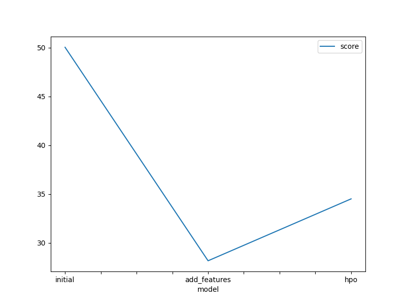
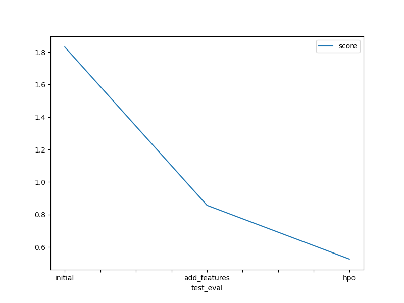

# Report: Predict Bike Sharing Demand with AutoGluon Solution
#### Hafida Belayd

## Initial Training
### What did you realize when you tried to submit your predictions? What changes were needed to the output of the predictor to submit your results?
Upon attempting to submit predictions, it was noted that some models generated negative prediction values, rendering them ineligible for submission. To rectify this issue, negative predictions were replaced with zeros to comply with Kaggle's submission requirements.

### What was the top ranked model that performed?
The top-performing model was the WeightedEnsemble_L3 model, which utilized data with additional features created through exploratory data analysis (EDA) and feature engineering.

## Exploratory data analysis and feature creation
### What did the exploratory analysis find and how did you add additional features?
Exploratory analysis revealed insights into the dataset, leading to the creation of additional features. Features such as datetime were parsed to extract information like month, day, year, and hour. Categorical features like season and weather were transformed accordingly.

### How much better did your model preform after adding additional features and why do you think that is?
The inclusion of additional features significantly enhanced model performance by facilitating better analysis of seasonal patterns within the data, thereby improving regression accuracy.

## Hyper parameter tuning
### How much better did your model preform after trying different hyper parameters?
While hyperparameter tuning showed marginal improvements in some cases, it did not drastically enhance model performance. Tuning parameters such as num_leaves and dropout_prob were explored, with varying degrees of success.

### If you were given more time with this dataset, where do you think you would spend more time?
Given more time, further exploration of hyperparameter configurations and extensive data analysis could yield better-tuned models, potentially enhancing predictive accuracy.

### Create a table with the models you ran, the hyperparameters modified, and the kaggle score.
|model|hpo1|hpo2|hpo3|score|
|--|--|--|--|--|
|initial|default_vals|default_vals|default_vals|1.83131|
|add_features|default_vals|default_vals|default_vals|0.85666|
|hpo|GBM: num_leaves: lower=26, upper=66|NN: dropout_prob: 0.0, 0.5|GBM: num_boost_round: 100|0.52604|

### Create a line plot showing the top model score for the three (or more) training runs during the project.

### Create a line plot showing the top kaggle score for the three (or more) prediction submissions during the project.

## Summary
This project demonstrated the efficacy of AutoGluon in developing predictive models for bike sharing demand. By leveraging EDA, feature engineering, and selective hyperparameter tuning, significant improvements in model performance were achieved. However, further refinement and exploration of hyperparameter configurations could potentially enhance predictive accuracy. Overall, this endeavor underscores the importance of data preprocessing and thoughtful feature selection in building robust predictive models.
